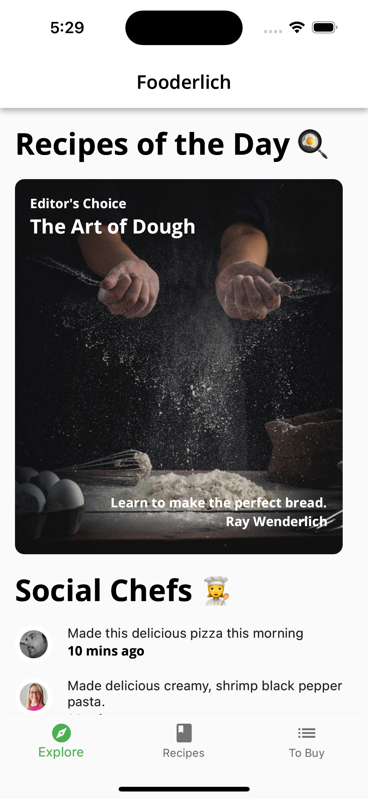
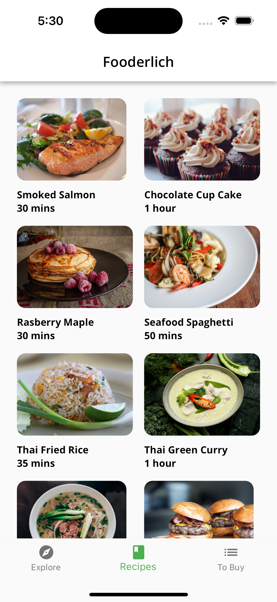

# Fooderlich

A sample recipe app from Kodeco Flutter Apprentice Book.
Originally, the source code from the book uses Provider as the state management.
This repository aims to replace the use of Provider with Riverpod as one of my attempts to learn state management especially Riverpod in Flutter.

## Screenshots

<p float="left">




</p>

## Getting Started

These instructions will get you a copy of the project up and running on your local machine for development and testing purposes. See deployment for notes on how to deploy the project on a live system.

### Installing

```
1. Clone or download this project
2. Open the project using Android Studio or VSCode
3. Run pub get 
4. Run using a simulator or real device
```
